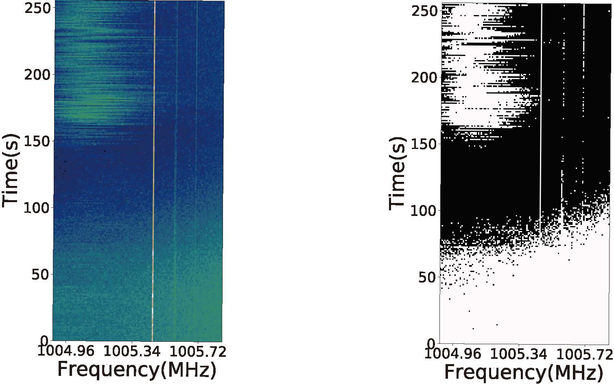

# RFI-Net
This repositories is for the Radio frequency interference (RFI) detection

In the folder data-set, the file data_preprocessing.py is to packed the data into tfrecord for train and validation. The test data is packed as hdf5 file.

In the folder RFI-Net, the rfi-net.py is where the model is constructed and train, validate and test.

The detection result is show as below:

The paper of RFI-Net has been published in Monthly Notices of the Royal Astronomical Society (please see [Deep residual detection of radio frequency interference for FAST](https://doi.org/10.1093/mnras/stz3521 "RFI-Net for RFI detection"))
