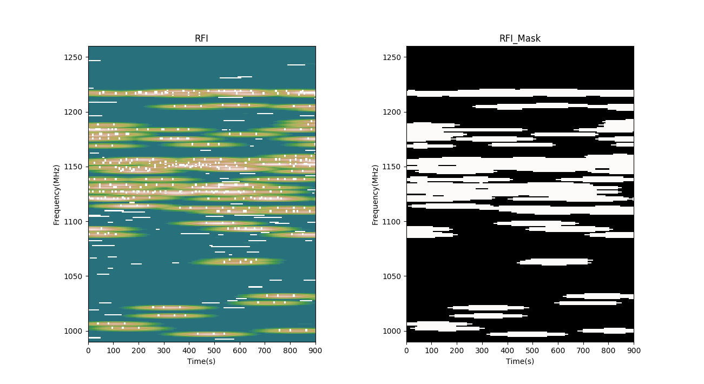

# RFI-Net
This repositories is for the Radio frequency interference (RFI) recognition

In the folder data-set, the file data_preprocessing.py is to packed the data into tfrecord for train and validation. The test data is packed as hdf5 file.

In the folder RFI-Net, the rfi-net.py is where the model is constructed and train, validate and test.

The recognition result is show as below:

